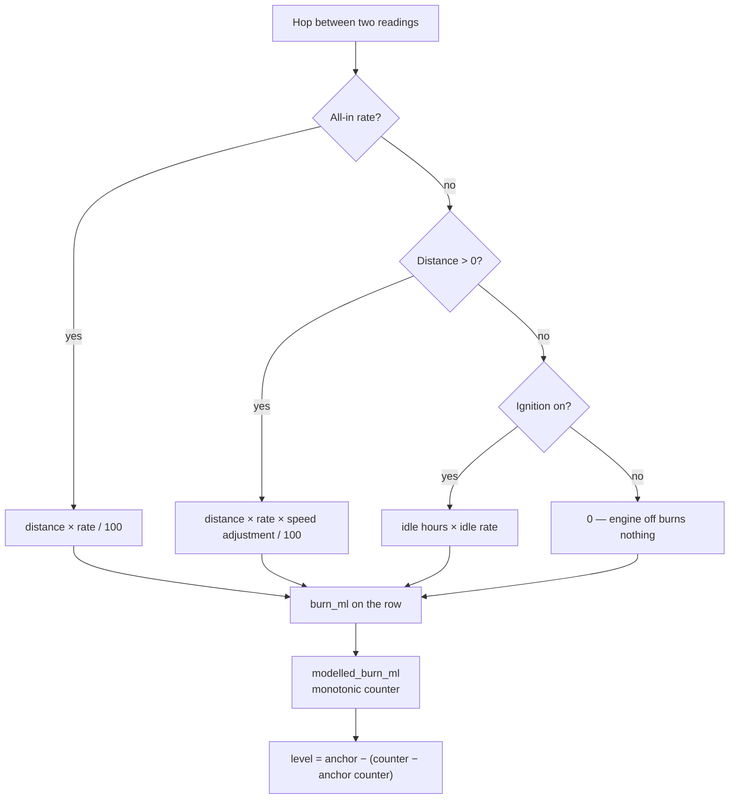

# The fuel model

:::warning The tank is an estimate
The fuel level FuelSense shows is **modelled from distance and idle time**, not
read from a sensor. It must never be labelled a measurement anywhere in the
product. This page explains what the model can and cannot tell you.
:::

## Where the rate comes from

Every vehicle has **one** rate, `vehicles.consumption_rate_l_per_100km`, and
every screen burns at it: the tank, trip history, daily activity and the
daily email report. They used to disagree — trip history priced a 2013 RAV4
from a table keyed on the model name (7 km/L for every RAV4 ever made) while
the vehicle record carried 18 L/100 km learned from partial fills.

| `rate_source` | Where the figure came from | Treated as |
| --- | --- | --- |
| `catalogue` | **EPA city rating** for the make, model and year — or, for a model the EPA never rated, the catalogue's own city figure | City driving rate |
| `manual` | The manager typed the long-term average from the vehicle's trip computer | All-in |
| `calibrated` | Measured from two fills to full | All-in |
| `preset` | Make/model not in the catalogue — a class average | City driving rate |

**The EPA city rating is the reference, not the brochure combined figure.**
Fleets here drive in stop-start traffic with the air conditioning on; the
city test cycle is the closest the EPA publishes to that. For each model
year the figure is the best `city08` among petrol, non-hybrid, two-wheel-drive
versions — the base engine, which is what fleets buy. A 2013 RAV4 is **23 mpg
city, 30 highway** (10.23 L/100 km city). Ratings are US gallons, and so is
every mpg the product shows.

The data lives in `backend/src/features/vehicles/vehicle-epa-economy.service.ts`,
generated from the EPA's own `vehicles.csv`. 28 catalogue models are covered.
Models sold in the US under another name borrow its rating **only for the years
they are the same car**: Cerato → Forte, Almera → Versa (2012–19),
X-Trail → Rogue (2014+), Patrol → Armada (2017+), Pajero → Montero (to 2006).
Models the EPA never rated — Hiace, Hilux, Prado, Coaster, buses, trucks — keep
the catalogue's own city figure.

At onboarding the form fills the economy field with the EPA figure the moment
make, model and year are picked, and says where it came from. **Left as it
is, it is saved as `catalogue`. Changed, it is saved as `manual` and wins** —
a 2005 Corolla rated 28 mpg that the manager knows does 18 is stored at 18.

## How a litre is charged

Every hop between two readings is charged exactly once:

```
if the rate is all-in (manual or calibrated):
    burn = distance_km × rate / 100            ← nothing on top
else if the hop covered ground:
    burn = distance_km × rate × speed_adjustment(avg_speed) / 100
else if the engine was on:
    burn = idle_hours × idle_burn_rate_l_per_hour
else:
    burn = 0
```

Never both distance and idle on the same hop — that double-bills a vehicle
crawling in traffic. Rates are read from the **vehicle record** on every
reading, so a change on the calibration screen takes effect immediately rather
than from the next trip.

### City to highway

A city rate is right for city driving and wrong on the expressway: every rated
car burns less at a steady highway speed (the 2013 RAV4 goes from 23 to 30
mpg). So the rate slides with the hop's **average** speed — distance over
elapsed time, never the instantaneous speed on the closing packet:

| Average speed | Rate |
| --- | --- |
| up to 36 km/h | the city rate |
| 36–80 km/h | slides linearly from city to highway |
| 80 km/h and above | the highway rate = city rate × (EPA city mpg ÷ EPA highway mpg) |

The two anchor speeds are where the EPA cycles and Wialon's sensorless model
put them (see [How this compares](#how-this-compares)). **Stop-start is not
charged extra**: the EPA city cycle already contains frequent stops, and time
standing still with the engine on is charged separately as idle.

No adjustment is ever invented. A vehicle with no EPA highway rating, a hop
with no usable speed, and any all-in rate get the stored rate as it is.

:::note Replaced 2026-09-28
The model used to multiply the rate by ×1.3 below 20 km/h and ×1.1 from 60 to
100 km/h. On top of an EPA city figure both were wrong — crawling was billed
twice and highway driving was billed as *worse* than city. On Sunday 27
September the reference RAV4 covered 114.8 km; the old model put it at
18.1 L / ₦26,083, the new one at **12.2 L / ₦17,580**.
:::

All three consumers call the same code — `tripFuelLiters()` and
`speedAdjustment()` in `fuel-metrics.service.ts`, `modelHopBurnMl()` in the
tank — so a trip cannot be priced one way in trip history and another in the
daily report. Trip history shows each trip's mpg and, on hover, its working:
`86.4 km at 23 mpg + 17m idle × 0.85 L/h = 9.1 L`.


```mermaid
flowchart TD
  H["Hop between two readings"] --> A{"All-in rate?"}
  A -->|yes| F["distance × rate / 100"]
  A -->|no| M{"Distance > 0?"}
  M -->|yes| D["distance × rate × speed adjustment / 100"]
  M -->|no| I{"Ignition on?"}
  I -->|yes| J["idle hours × idle rate"]
  I -->|no| Z["0 — engine off burns nothing"]
  F --> B["burn_ml on the row"]
  D --> B
  J --> B
  Z --> B
  B --> T["modelled_burn_ml<br/>monotonic counter"]
  T --> L["level = anchor − (counter − anchor counter)"]
```

The level itself is **anchored**, not accumulated: a calibration sets
`anchor_liters` and `anchor_modelled_ml` together, and the level is derived from
the difference. Re-anchoring is one write, not a rewrite of history.

## Why the model replaced the device's own figure

The tank used to run on AVL 12, the device's fuel accumulator. It read roughly
**5× too full and drifted further every trip**.

The reason is covered in [What the hardware sends](/data/avl-elements): AVL 12
counted 13 ml across 3.55 km, while AVL 13 reported a constant 2.47 L/h with the
engine off. Neither is measured; the firmware derives both from consumption
parameters that were never set in the Configurator. Replayed over a real 3.6 km
drive with 9.1 minutes of idling, AVL 12 gave **0.145 L** where the model gives
**0.742 L** at 15 mpg.

The proper fix remains setting those Configurator parameters. Until then, the
model is the honest option, and both elements are retained as diagnostics.

## The tautology to avoid

This is the trap that matters most when building UI on top of the model.

> Economy computed as `distance ÷ modelled litres` is **circular**. It returns
> the rate you entered, minus an idle penalty. It can never disagree with the
> vehicle's own settings, so it cannot *measure* efficiency.

A dashboard once showed "Economy 12.6 mpg vs benchmark" for a vehicle
configured at 15 mpg. The 12.6 was not a finding — it was 15 mpg diluted by that
period's idling, dressed up as a measurement and compared against a benchmark as
if it could fail.

The same two numbers do say something real once the idle share is split out:

```
rated economy    = distance ÷ (modelled litres − idle litres)   ← what you entered
effective economy = distance ÷ modelled litres                   ← after idling
idle drag         = rated − effective
```

**Idle drag is actionable.** It says "idling cost you 2.4 mpg and 1.9 L this
period", which a manager can do something about. That is what the product shows
in place of the circular economy figure.

## Marker rows

Three events change the level without being consumption the tracker saw: a
**calibration**, a **receipt credit**, and an **odometer gap**. All are written
as `telemetry` rows carrying `fuel_source` in `FUEL_MARKER_SOURCES`
(`calibration`, `receipt`, `odometer_gap`), and every consumption query skips
them.

Without this, a calibration from 29.95 L to 20.00 L was counted as 9.95 L of
burn — it slipped between the refuel guard (a rise of ≥5 L) and the siphon guard
(a drop of ≥12 L while parked). The symptom was a driver report showing **10.0 L
against 0 km and 0 trips**.

Markers carry the **last known odometer**, never NULL, because the distance CTEs
chain `LAG(odometer)` across every row and a NULL silently drops a hop.

:::note Historical data
A calibration made before marker rows existed landed on an ordinary row and is
not retroactively taggable. Older calibrations still read as burn unless
backfilled individually from `virtual_tanks.calibrated_at`.
:::

## Receipts only add litres

A receipt — from the driver app or entered by a manager — is **recorded, not
judged**. Its litres are added to whatever the tank holds, and nothing else
happens to the level:

- **No tank questions.** Neither form asks whether the tank was filled to full
  or what the gauge read (E, ¼, ½…). Both used to pin the level to something
  eyeballed at the pump, overriding the litres the same receipt had just
  credited: eighths of a 60 L tank are 7.5 L apart and a gauge is not linear,
  and the manager form had "filled to full" ticked by default, resetting the
  tank to 60 L on every entry. The server ignores both fields even from an old
  app build.
- **No verdict.** Driver receipts are no longer checked against the station or
  the modelled tank, and never raise a theft flag or a `receipt_fraud` alert.
  The station check compared the slip against where the *phone* was at upload
  time, so a driver who filed from home that evening was "21 km from the
  station" and flagged for the full ₦20,000. Nothing on this hardware measures
  fuel, so neither check could tell honest from not. A manager still approves
  or rejects each receipt on the Receipts page.
- **A manager can file for a driver** with no phone: Receipts → *Add receipt*,
  with the same photo scan the driver app uses. The vehicle list names each
  vehicle's driver, and the entry is stored as verified by the manager.

## Distance the tracker missed

The tank only burns for distance the tracker counts. Driven with the tracker
unplugged or off air, a vehicle comes back with its tank reading high. The fix
is the dashboard odometer: in **Settings → Vehicle odometers** the manager
re-reads it, and anything it is ahead of ours is distance the tracker missed.

```
missed_km  = dashboard reading − highest reading ever entered (+ tracker km since)
missed_L   = missed_km × rate / 100
tank level = tank level − missed_L          ← re-anchored, odometer_gap marker
```

That fuel comes out of the tank, the model is re-anchored so the next tracker
frame keeps the lower level, and the odometer history records it: *"tracker
missed 62 mi; 10.2 L taken from the tank"*. It is not invented as a trip.

Built so it cannot manufacture fuel:

| Case | What happens |
| --- | --- |
| First reading ever entered | Anchors only — nothing to compare against, nothing booked |
| Reading below ours | Re-anchors the odometer; fuel is never added back |
| A mistyped low reading, later corrected | Measured from the **highest** reading ever entered, so the correction is not billed as driving — a dashboard odometer never runs backwards |
| More than 1,500 km ahead | Refused as a likely typo or miles/km mix-up |
| Under 2 km ahead | Rounding between dash and tracker; nothing booked |

## What the fuel in the tank cost

The tank models **litres**. It carries no price of its own beyond one number:
`virtual_tanks.avg_cost_ngn_per_liter`, the volume-weighted cost of the fuel
currently in it.

Fuel mixes, so a tank is not a queue — there is no way to burn "the old litres
first", and FIFO would be a fiction. Each priced fill is blended in:

```
new_avg = (litres_before × avg_before + litres_added × fill_price)
          ÷ (litres_before + litres_added)
```

10 L left at NGN 1,275 plus 40 L at NGN 1,440 is 50 L at **NGN 1,407/L**, and
the next litre burned costs 1,407 whichever pump it came from. Consumption
never moves the average — only a fill does — so there is nothing to recompute
per reading and nothing to drift.

Two edges, both deliberate:

- **A fill with no known price leaves the average alone.** Keeping the last
  known cost beats blending in a guess.
- **A tank whose fuel was never priced takes the fill price outright.** The
  newest fill is the only evidence there is.

`avg_cost_ngn_per_liter` is **nullable and never backfilled**. Nobody knows what
the fuel already sitting in a tank cost, and inventing a figure would be the
same mistake described below. A tank prices itself on its first priced fill;
until then `fuel_value_ngn` is null and the UI shows litres without money.

:::warning Never value a tank at today's price
`level × today's pump price` restates what last month's fuel cost every time
the price moves. On the reference fleet the declared benchmark sat at NGN 1,310
from 18 August while receipts ran to NGN 1,440 — a 10% gap, applied to every
litre burned in between.
:::

## Which price values a litre

Four things once disagreed about what a litre was worth, and the same litre
could be valued three ways on one afternoon. There is now one resolution order,
`effectiveFuelPrice()`, and **nothing averages prices across time**:

| Order | Source | Why |
|---|---|---|
| 1 | Declared benchmark, if newer | What the manager committed to |
| 2 | Latest receipt, if newer | Proof beats intent, and pump prices move |
| 3 | `DEFAULT_FUEL_PRICE_NGN_LITER` | Last resort, must be labelled an assumption |

**Newest evidence wins.** A receipt dated after the last declaration is proof
the declaration has been overtaken; a stale benchmark silently understates
every naira figure in the product.

Period costs are valued **at the price in force on the day each litre burned**,
never at one flat rate for the window. `price_periods` in
`fleet-efficiency.repository.ts` unions declared prices with receipt prices so
each hop picks whichever evidence was most recent at that moment.

:::danger Never store an assumed price
`fuel_purchases.cost_per_liter_ngn` means *what was actually paid* — it is read
back by `latestReceiptPrice()` and plotted as evidence. Both receipt routes
once defaulted it to the compiled-in constant, filing receipts at NGN 1,300
that nobody paid NGN 1,300 for and dragging the fleet's latest-receipt price
down to the constant. Both now **require** a price per litre or a total, and
store null rather than a guess.
:::

## One idle spell, not several

An idle stretch is held open through a **GNSS wobble**. A parked car regularly
reports a few km/h of Doppler noise, and a single such frame used to close the
stretch outright — so one 25-minute warm-up on 26 September was written as two
spells, 14 minutes ending 16:52 and 10 minutes starting 16:53, from positions
15 m apart.

That is not a cosmetic double-entry. One `excessive_idle` alert is raised per
stretch, and open alerts drove the fleet verdict, so a split warm-up made a
working fleet read "Needs attention".

| Speed, engine on | Reading |
| --- | --- |
| Below `IDLE_SPEED_KPH` (2) | Idling |
| Between 2 and `MOVING_CONFIRM_KPH` (10) | Ambiguous — stretch held open |
| At or above 10 | Driving; stretch ends at the last stationary frame |

Ambiguous movement must persist for `MOVE_CONFIRM_MS` (60 s) before it counts
as driving away. Ignition off always ends a stretch immediately. **Time inside
the wobble window is never credited as idling** either way — if the vehicle
settles, the stretch resumes without it; if it drives on, the stretch ends at
the last frame that actually saw it stationary. Under-claiming is the safe
direction.

## Benchmarks must include idle

Expected fuel for a period has to include an idle allowance. Comparing
idle-inclusive modelled burn against a driving-only benchmark flags **every**
driver who sat in traffic, which is every driver in Lagos or Abuja.

## How this compares

Checked on 2026-09-28 against what the rest of the industry does without a
fuel sensor:

- **Wialon** (Gurtam), the platform most Teltonika fleets run on, has a
  sensorless *math consumption* model built from an urban rate referenced at
  **36 km/h**, a suburban rate at **80 km/h**, and a separate idle rate in
  L/h. FuelSense uses the same two anchor speeds and the same separate idle
  charge, with the EPA city and highway ratings as the two rates.
- **Geotab** does not estimate litres without engine data: every device
  reports distance and idle time, but fuel used comes from the engine computer
  or imported fuel-card fills.
- **Samsara, Webfleet and Verizon Connect** do not publish how, or whether,
  they estimate fuel without engine or sensor data.
- **Idle burn.** The US Department of Energy, from Argonne National Laboratory
  measurements, puts a compact 2.0 L sedan at about 0.16–0.17 US gal/h
  (~0.6 L/h) at idle and a 4.6 L sedan at just over twice that. The reference
  RAV4 (2.5 L, AC on) runs at 0.85 L/h — inside that range.

## Sources

- EPA fuel economy data, `vehicles.csv` (city08 / highway08), downloaded
  2026-09-28 — [fueleconomy.gov](https://www.fueleconomy.gov/feg/epadata/vehicles.csv.zip)
- Wialon, *Math consumption* —
  [help.wialon.com](https://help.wialon.com/en/wialon-hosting/expert-articles/fuel/math-consumption)
- Geotab, *Fuel Usage and Fill-Ups FAQ* —
  [support.geotab.com](https://support.geotab.com/mygeotab/doc/fuel-fill-ups)
- Argonne National Laboratory, *Idle Reduction Research* —
  [anl.gov](https://www.anl.gov/esia/idle-reduction-research)
- US Department of Energy, idling fuel use by vehicle —
  [energy.gov](https://www.energy.gov/node/1017831)
